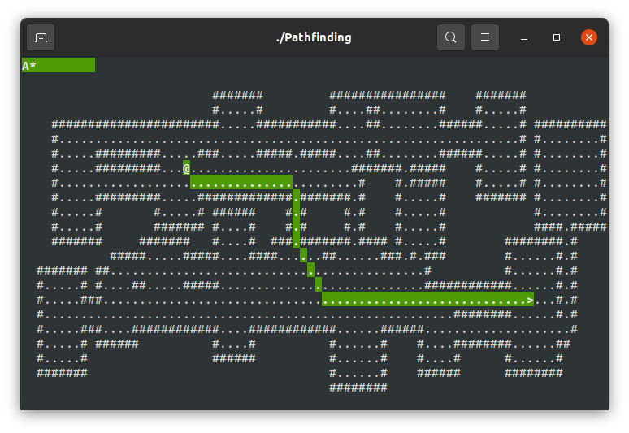

## Pathfinding Demo

Simple demo showing off the different paths generated by:

- Breadth First Search `1`
- Best First Search (Greedy, early exit) `2`
- Astar `3`

Press the corresponding key to show the path highlighted, `0` to show no path.
`>` regenerates the map. 

Move the `@` with the VI keys or the arrow keys. Press `.` to take an automatic
step along the path.

Needs NCurses installed to work - and should work on anything with a terminal.
Only tested on Linux.
