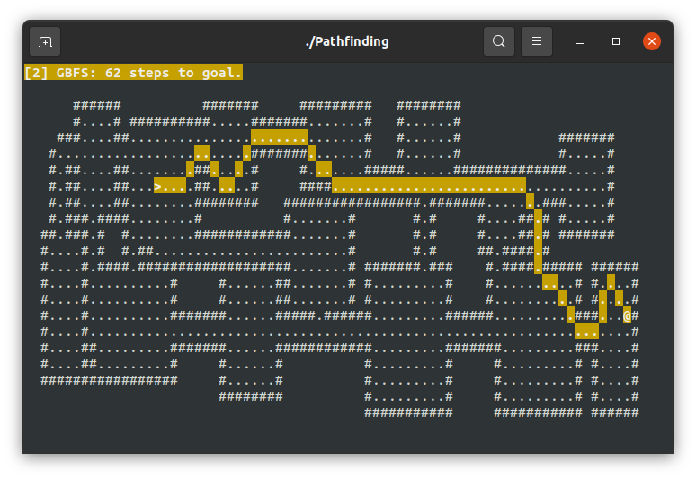
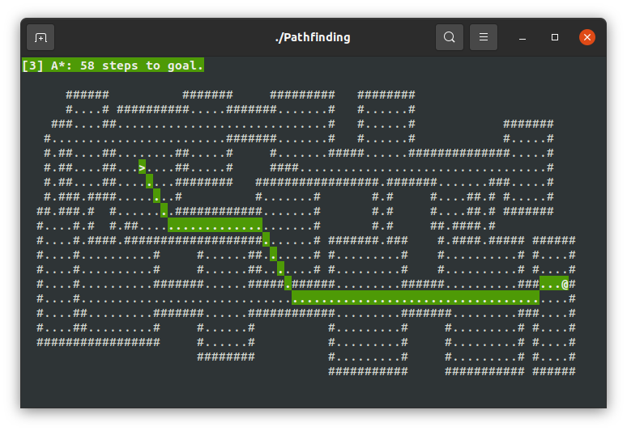

## Pathfinding Demo

Simple demo showing off the different paths generated by:

Press the corresponding key to show the path highlighted, `0` to show no path.
`>` regenerates the map. 

- Breadth First Search `1`

- Best First Search (Greedy, early exit) `2`

- Astar `3`

- Bresenham's Line `4`

Move the `@` with the VI keys or the arrow keys, the path will update. Press `.`
to take an automatic step along the path.

Press `5` to write a dijkstra map to a text file showing how far each open tile
is from the player.

Needs NCurses installed to work - and should work on anything with a terminal.
Only tested on Linux.

